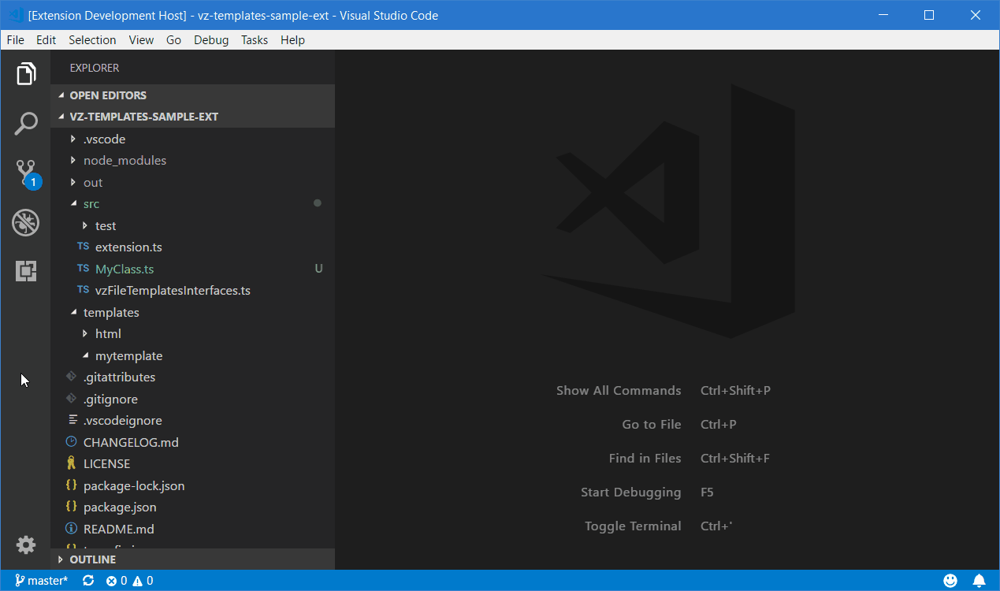

# VZ File Templates for Visual Studio Code

## Features

VZ File Templates extension adds single and multi-file templates to Visual Studio Code. It allows developer to select a template in a visual way, just like in the big Visual Studio. 

To invoke template selection, simply right click on folder or file in vs code file explorer and choose "New File from Template" menu item.


Templates are loaded from this extension resources and from user defined folders specified in "vzfiletemplates.userTemplatesFolders" setting. Sample setting can look like this one:

```
    "vzfiletemplates.userTemplatesFolders": [
        "d:\\vscode\\templates"
    ]
```

It will also be possible to run additional wizard, specific to selected template in the next versions of this extension (i.e. show a page to collect asp.net view details and generate code).

## Template definition

Each template has to be saved in a separate folder as template definition file has to be named "template.json". Basic, single file template requires 4 separate files: definition, template file, dark template icon and light template icon:
* definition - it is json file and it should always be names "template.json"
* template file - this is a file that will be used to create your file from the template. It is possible to use variables inside this file and they will be replaced with their values when files are created from the template.
* dark icon - template icon displayed when vs code uses dark color theme
* light icon - template icon displayed when vs code uses light color theme

New templates can be created manually, but they can also be created using template available under "Other" category:




### Template file

Here is sample "template.json" file:
```
{
    "name" : "TypeScript class",
    "description" : "New TypeScript class",
    "defaultName" : "NewClass.ts",
    "sortOrder" : "100",
    "category" : "TypeScript",
    "iconLight" : "icon-light.svg",
    "iconDark" : "icon-dark.svg",
    "elements" : [
        {
            "fileName" : "file.txt",
            "targetName" : "$itemname$.ts",
            "replaceParameters" : true,
            "open" : true
        }
    ]
}
```

* "name" - contains template name displayed in template selection page
* "description" - contains longer description of the template and is displayed on the right side of template selection page when template is selected
* "defaultName" - default file name that will be used in "Name" text box in template selection page
* "sortOrder" - defines how templates should be ordered in template selection page
* "category" - specifies to which category displayed on the left side of template selection page template should be assigned
* "iconLight" - name of the file with the icon for light vs code theme
* "iconDark" - name of the file with the icon for dark vs code theme
* "elements" - list of template files, each entry can have these fields:
  * "fileName" - name of the source file 
  * "targetName" - name of the target file, you can use variables to make it dynamic
  * "replaceParameters" - if it is "true" then variables will be also replaced inside file content
  * "open" - if it is true or not specified, then file created from the template will be opened in vs code

### Template variables

At this moment only these variables are supported:
* $fileinputname$ - whole text entered into "Name" text box in template selection page
* $itemname$ - $fileinputname$ without file extension
* $safeitemname$" - $itemname$ with all non alphanumeric characters removed. It is usually used to specify class, function or variable name inside source files      

## Extension Settings

This extension contributes the following settings:
* `vzfiletemplates.userTemplatesFolders`: array of paths to folders containing user templates. Template manager scans all subfolders in these locations, so the only reason to specify more than one entry here is when templates are stored in completely separate folders (i.e. user templates and team templates)
* `vzfiletemplates.langServerProxyFolder`: folder for temporary files used to discover workspace symbols. When one of file wizards needs to get list of symbols from current workspace (i.e. list of classes or class fields to display them on screen), temporary file with a bit of code will be created in this folder and then code completion request will be send to the language server. After that call, file will be cleared, so no code will be left there.

## Release Notes

### 0.0.1

Initial release of VZ File Templates

